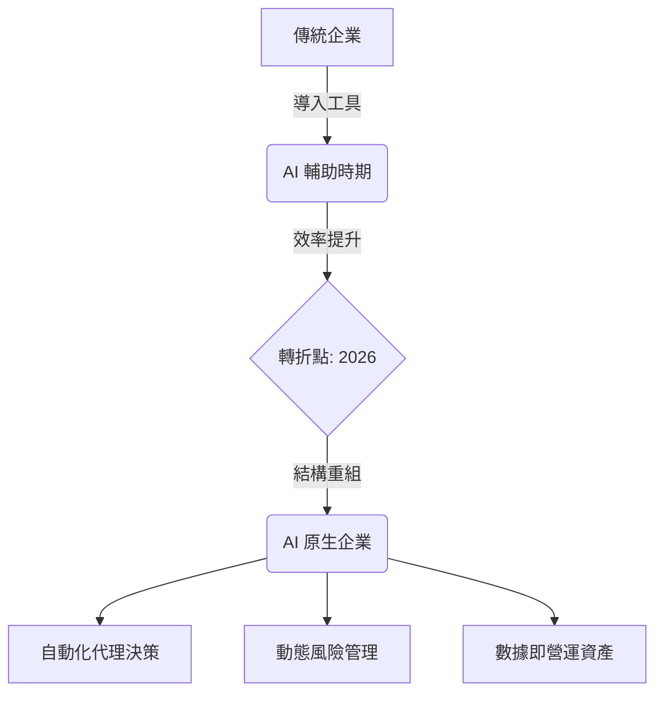

---
layout: default
title: 第 1 章｜2026，AI 經濟的新規則
---

# 第 1 章：2026，AI 經濟的新規則

> 從 AI 輔助走向 AI 原生，不只是工具升級，而是企業運作規則、風險模型與安全邏輯的全面改寫。

## 本章摘要

2026 年被視為 AI 經濟正式成形的時間點。企業不再只是將 AI 作為效率工具，而是把 AI 代理程式納入營運結構，直接承接決策、分析、協作與執行任務。這個轉變帶來前所未有的生產力，也同步放大了身分、資料與信任層面的風險。

## 1.1 從 AI 輔助邁向 AI 原生

在先前幾年，AI 主要扮演輔助角色，用來加速既有流程，例如整理資料、產生內容或改善客服回應。但到了 2026 年，AI 不再只是人類工作的附屬工具，而開始直接成為營運鏈的一部分。

這意味著企業正從「把 AI 加進流程」轉向「以 AI 為前提重新設計流程」。自主 AI 代理程式具備推理、行動與記憶能力，能從警報分流、商業分析、財務模型到內部流程自動化，接手大量原本由專業人員負責的工作。

## 1.2 82:1 人機混合勞動力的新現實

一項關鍵指標顯示：一個具象的衝擊指標：機器與代理程式相對於真人員工的比例，可能來到 82:1。這個比值代表的不是單純的人數比較，而是企業內部可執行任務的數位主體數量大幅擴張。

這種變化帶來三類核心資安風險。

第一，內部威脅模型被改寫。設定錯誤、權限過大或遭惡意操控的 AI 代理，可能以高於人工處置速度的方式進行權限濫用、資料提取或工具串接。

第二，真實性危機快速升高。當生成式 AI 已能即時複製聲音、語氣與影像，主管所收到的指令、會議中的授權甚至外部聯繫對象，都更難以單靠直覺判斷其真偽。

第三，企業前門發生轉移。瀏覽器、聊天介面與 AI 協作平台成為新的工作入口，但這些入口往往同時也是新的資料外洩與提示注入路徑。

## 1.3 安全從成本中心轉向創新引擎

當 AI 原生模式成為企業日常，傳統「安全是成本、速度是業務」的二分法會迅速失效。真正的問題不再是要不要做安全，而是如果沒有可信的身分、資料與授權機制，企業根本無法大規模、安全地使用 AI。

在這個條件下，安全開始扮演三個新的角色。

可信基礎： 安全機制提供可驗證的身分、資料邊界與授權規則，使組織敢於把更重要的流程交給 AI 與自動化系統。

競爭優勢： 當其他組織仍困在治理混亂與風險不明的狀態時，能以安全為基礎快速上線新服務的企業，將擁有更高的商業敏捷性。

主動防禦能力： 安全不再只是事件發生後的補救部門，而是支撐決策速度、產品可信度與營運韌性的核心能力。

## 深度分析

真正值得注意的是，AI 原生並不等於「所有事情都交給 AI」。它更像是一種新的組織設計方式：讓大量數位代理接手高頻、可拆解、可編排的工作，再由人類保留判斷、責任與邊界設定。問題在於，多數企業在流程重設之前，往往先引進工具。這使 AI 很容易先被導入既有流程的縫隙裡，卻沒有同步補上身分驗證、權限管理、資料分級與審計紀錄。

因此，2026 年的挑戰不只是生產力突然暴增，而是安全邏輯必須先於規模擴張而成熟。當代理可以讀取資料、呼叫工具、代表員工執行操作時，企業實際上等於在內部增加了大量具有行動能力的新角色。若這些角色的信任邊界沒有被精確定義，風險就會以與效率相同的速度擴散。

換句話說，AI 經濟真正的規則不是「先上線，再補安全」，而是「可信任，才有辦法規模化」。這也是為什麼本章把安全定位為創新引擎，而不是防守成本。沒有可信的結構，AI 原生營運只會讓企業更快地把錯誤、自動化與風險一起放大。

## 本章結論

2026 年的關鍵不是 AI 是否繼續成長，而是企業是否準備好迎接 AI 原生的組織結構。當任務執行者從人類擴展為大量數位代理，安全必須同步升級為營運設計的一部分，否則效率提升將直接轉化為風險擴張。

## 關鍵字

- AI 原生
- 82:1 人機混合勞動力
- Autonomous AI Agents
- 真實性危機
- 創新引擎

## 摘要卡

- 核心命題：2026 年是企業從 AI 輔助跨入 AI 原生營運的分水嶺。
- 主要風險：代理權限濫用、深偽指令、瀏覽器與協作平台成為新前門。
- 防禦重點：把身分、資料與授權控制直接嵌入營運流程。
- 讀者收穫：理解為何安全在 AI 時代不再只是成本項目。

## 引用資料來源

- National Institute of Standards and Technology. (2023). [Artificial Intelligence Risk Management Framework (AI RMF 1.0)](https://doi.org/10.6028/NIST.AI.100-1). U.S. Department of Commerce.
- National Institute of Standards and Technology. (2024). [Artificial Intelligence Risk Management Framework: Generative Artificial Intelligence Profile (NIST AI 600-1)](https://doi.org/10.6028/NIST.AI.600-1). U.S. Department of Commerce.
- Organisation for Economic Co-operation and Development. (2019). [OECD AI Principles](https://oecd.ai/en/ai-principles). OECD.
- Verizon. (2025). [2025 Data Breach Investigations Report](https://www.verizon.com/business/resources/reports/dbir/). Verizon Business.

[返回全書總覽](../book.md)
