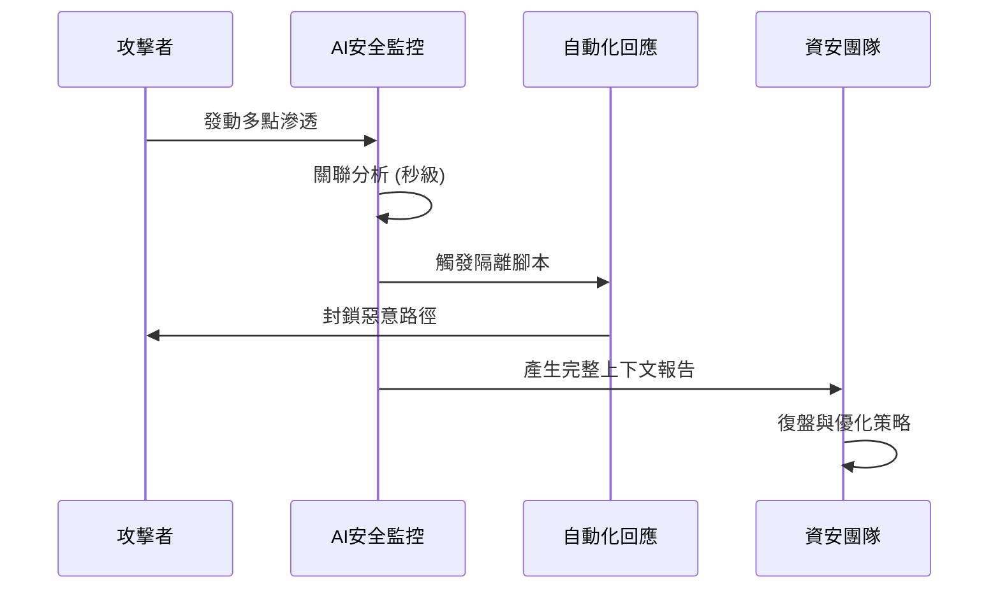

---
layout: default
title: 第 2 章｜防衛者之年：重奪主動權
---

# 第 2 章：防衛者之年：重奪主動權

> 當攻擊速度交給機器，防禦如果還停留在人工流程，就註定落後。2026 年的轉折，在於防禦方終於開始具備同等級的速度與自動化能力。

## 本章摘要

長期以來，資安被視為一場結構性不對稱的戰爭。攻擊者只需找到一個突破口，防禦者卻得維持全面警戒。在 2026 年，我們看到了一個重要逆轉點，防禦方可望透過資料整合、AI 原生平台與自動化營運，重新取得攻防節奏的主導權。

## 2.1 為何 2026 年是防衛者的契機

過去幾年，外界普遍相信 AI 對攻擊者更有利，因為它能降低社交工程、惡意程式開發與詐騙擴張的成本。但到了 2026 年，防禦方也開始掌握 AI 的規模效應。

最關鍵的改變在於速度。當整合式平台能在幾分鐘內完成偵測、關聯、分流與初步阻斷，防禦已經不再完全依賴人工作業。這讓企業首次有機會縮小甚至反轉攻防之間的時間差。

除了技術面，經濟面也開始出現回饋。具備高度自動化安全能力的組織，可能獲得更低的風險保費、更快的系統上線速度，以及更可預期的營運韌性。安全因此不再只是成本負擔，而成為具體的商業優勢。

## 2.2 從後線防禦轉向主動進攻

面對 AI 原生威脅，被動式安全已經不足。傳統模式往往在事故發生後才展開調查、補救與通報，但這種節奏無法應對機器速度的攻擊。

主動防禦的核心，不是更頻繁地修補，而是更早地辨識暴露面、建立可預測的治理節奏，並在風險升級前就採取行動。這也是持續威脅暴露管理與預測性情資的重要性所在。

另一個重點是信任重建。保護外部邊界已經不夠，企業需要確保每一次資料流動、每一個身分行為與每一筆權限使用，都能被驗證、追溯與限制。

## 2.3 代理式 SOC 與分析師角色轉型

AI 代理程式正在改寫安全營運中心的工作方式。原本讓分析師疲於奔命的海量警報，可以先由代理完成初步分流、上下文整理與回應建議，讓人類專家把時間留給高風險判斷與策略決策。

這帶來三個直接效果。

第一，警報疲勞下降。例行重複的分類與關聯任務可被自動化吸收。

第二，專家角色上移。分析師不再主要負責搬運資訊，而是驗證 AI 的判斷品質、設定回應原則，並決定何時升級成重大事件處理。

第三，反應時間被壓縮。當 SOAR 與 AI 代理結合後，從偵測到阻斷的流程可從數小時縮短到數分鐘，這對勒索軟體、帳號濫用與橫向移動等威脅尤其關鍵。

## 深度分析

防衛者之年這個說法之所以成立，不是因為防禦者突然擁有了完美工具，而是因為資料、決策與行動之間的延遲開始被縮短。過去許多安全工具其實並不缺告警能力，而是缺少把上下文整合成可執行判斷的能力。當 AI 代理可以先完成資料關聯、風險摘要與優先級建議，分析師就能把有限時間留給真正需要人類判斷的高風險案例。

這也意味著安全團隊的組織設計會跟著變。傳統的分工方式強調層層分流與人工交接，但在高速度威脅環境中，這種流程常常就是最大的瓶頸。2026 年更有效的模式，是讓低價值重複任務自動化，並把專家時間集中在原則設計、情境判斷與跨部門協調上。

一旦安全可以以更低摩擦融入營運，它就會從部署阻力轉變成部署前提。企業在推出新產品、導入新流程或授權新代理之前，不再把安全視為「之後再補」，而是視為是否能快速而安心上線的核心條件。這正是防禦方真正重奪主動權的起點。

## 本章結論

2026 年之所以被稱為防衛者之年，不是因為威脅變少，而是因為防禦方終於開始擁有與攻擊者相近的速度、規模與自動化能力。真正的分水嶺，不在工具數量，而在組織是否願意把安全營運視為核心業務能力。

## 關鍵字

- Year of the Defender
- 自動化 SOC
- SOAR
- 主動防禦
- 機器速度回應

## 摘要卡

- 核心命題：2026 年是防禦方可望以平台、自動化與資料整合重奪主動權的年份。
- 主要風險：若仍停留在人工流程，反應速度將持續落後 AI 驅動的攻擊。
- 防禦重點：建立可持續運作的安全營運、自動分流與風險預判機制。
- 讀者收穫：理解安全團隊如何從被動救火轉型為主動營運。

## 引用資料來源

- Verizon. (2025). [2025 Data Breach Investigations Report](https://www.verizon.com/business/resources/reports/dbir/). Verizon Business.
- National Institute of Standards and Technology. (2012). [Computer Security Incident Handling Guide (SP 800-61 Rev. 2)](https://doi.org/10.6028/NIST.SP.800-61r2). U.S. Department of Commerce.
- MITRE. (n.d.). [ATT&CK Framework](https://attack.mitre.org/). The MITRE Corporation.
- National Institute of Standards and Technology. (2024). [Cybersecurity Framework 2.0](https://doi.org/10.6028/NIST.CSWP.29). U.S. Department of Commerce.

[上一章：第 1 章](./ch01.md)

[下一章：第 3 章](./ch03.md)
