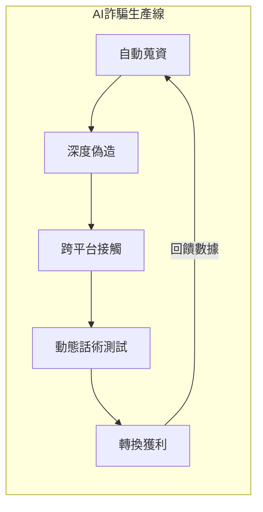

---
layout: default
title: 第 3 章｜自動化詐騙的崛起
---

# 第 3 章：自動化詐騙的崛起：從社交工程到 AI 代理

> 詐騙不再只是訊息模板與話術劇本，而是一條由 AI 持續優化、跨平台串接、近乎工業化的攻擊生產線。

## 本章摘要

2026 年的詐騙產業，已從過去的人工作坊模式，升級成由 AI 支撐的自動化系統。它能研究目標、調整語氣、跨平台遷移互動，甚至用深偽技術模擬真實人物。這使詐騙的規模、精準度與說服力都大幅升高。

## 3.1 代理型 AI 與詐騙工業化

「代理式 AI」（Agentic AI）的核心，不在於它能寫出更像人的文案，而在於它能自己完成一段攻擊流程。這類系統可以爬梳公開資料、整理目標輪廓、推測關係網絡，再根據互動反應自動修正下一步話術。

原本需要人員分工完成的蒐資、接觸、試探與轉換，如今可以被打包成低成本服務。這就是「詐騙即服務」（Fraud-as-a-Service）得以成熟的原因。攻擊者不再需要高階技術，只要租用現成工具，就能大規模發動高擬真度的詐騙行動。

## 3.2 多管道詐騙成為常態

在 2026 年，詐騙很少停留在單一管道。更常見的情況是，一則看似無害的簡訊或社群訊息，先把受害者帶進一段互動，再逐步移往加密通訊軟體或專屬網站，完成信任建立與金流誘導。

這種「詐騙流程」的風險，在於每一步看起來都不夠重大，卻能在跨平台轉換過程中逐步降低受害者警戒。加上詐騙網站短命、可拋棄、快速輪替，防禦與追查的難度也同步提高。

## 3.3 深偽與真實性危機

當深偽技術進入即時、低成本與高擬真階段後，傳統的辨識線索快速失效。拼字錯誤、制式口吻與粗糙圖像，已不再是可靠的判斷依據。

企業場景中最危險的例子，是利用聲音複製與換臉技術製造高階主管分身，在視訊或語音情境中下達資金調度、帳號重設或緊急授權指令。個人場景中，則可能透過 AI 伴侶、深偽親密關係與高度客製化對話，進行情感操控、投資詐騙或性勒索。

這類攻擊的本質，是把「真實性」本身變成攻擊面。當人無法再憑直覺判斷對話對象是否可信，企業就必須依靠制度化驗證，而不是個人警覺。

## 深度分析

自動化詐騙真正危險的地方，在於它把受害者原本可以察覺的不自然感磨掉了。過去許多詐騙之所以容易被辨識，是因為話術僵硬、語氣不對或背景資訊不足；到了代理型 AI 時代，攻擊者可以在互動過程中動態補完這些缺口，讓整段詐騙體驗更像是一場持續被優化的客戶旅程。

這也讓企業的責任邏輯發生改變。若風險已不再只是「員工會不會點選惡意連結」，而是「整個溝通流程是否具備驗證設計」，那麼真正的防護重點就不應停留在宣導海報或一次性的教育訓練。企業需要在財務調度、身分核驗、跨平台對話與高風險流程中，建立可重複執行的確認機制。

對個人而言，2026 年最重要的防詐能力也不只是辨識技巧，而是對流程的警覺。當一段對話開始要求你轉移平台、加速決策、跳過正式管道或以高度情緒化方式施壓時，應被懷疑的不是單一訊息真假，而是整條互動鏈是否正在被設計成一場攻擊。

## 本章結論

2026 年的詐騙風險，不只是量變，而是質變。AI 讓詐騙從個別事件變成可規模複製的服務產業，也讓信任從一種社會直覺，變成必須被技術與流程共同保護的資產。

## 關鍵字

- Agentic AI
- Fraud-as-a-Service
- 多管道詐騙
- Deepfake
- 真實性危機

## 摘要卡

- 核心命題：AI 正把詐騙從人工作坊升級成自動化、跨平台且可規模複製的產業。
- 主要風險：深偽分身、多管道誘導、情感操控與可拋棄式詐騙基礎設施。
- 防禦重點：建立驗證機制而非只依賴使用者警覺。
- 讀者收穫：看懂 2026 年詐騙從社交工程走向代理化攻擊的脈絡。

## 引用資料來源

- Federal Bureau of Investigation, Internet Crime Complaint Center. (2024). [2024 IC3 Annual Report](https://www.ic3.gov/AnnualReport/Reports/2024_IC3Report.pdf). U.S. Department of Justice.
- Verizon. (2025). [2025 Data Breach Investigations Report](https://www.verizon.com/business/resources/reports/dbir/). Verizon Business.
- OWASP GenAI Security Project. (2025). [Top 10 Risk & Mitigations for LLMs and Gen AI Apps 2025](https://genai.owasp.org/llm-top-10/). OWASP Foundation.
- Europol. (2024). [Internet Organised Crime Threat Assessment (IOCTA) 2024](https://www.europol.europa.eu/publication-events/main-reports/internet-organised-crime-threat-assessment-iocta-2024). European Union Agency for Law Enforcement Cooperation.

[上一章：第 2 章](./ch02.md)

[下一章：第 4 章](./ch04.md)
