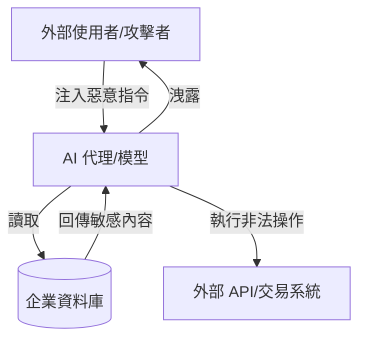

---
layout: default
title: 第 4 章｜操控 AI 的攻擊
---

# 第 4 章：操控 AI 的攻擊：提示詞注入與資料中毒

> 當企業把模型、代理與資料流納入營運中樞，攻擊者真正想奪取的，就不再只是系統控制權，而是 AI 的判斷權與信任基礎。

## 本章摘要

如果說前一章談的是 AI 如何被攻擊者拿來騙人，那麼這一章談的就是 AI 本身如何成為攻擊目標。2026 年，企業面對的不只是傳統基礎設施風險，而是整個 AI 生命週期都可能遭到操控，包括指令層、資料層、權限層與治理層。

## 4.1 提示詞注入成為企業 AI 的後門

提示詞注入（Prompt Injection）已不再只是概念驗證，而是會直接影響企業 AI 行為的實際攻擊手法。當模型或代理與 CRM、ERP、文件系統、客服流程或交易流程相連時，惡意提示就可能誘導它偏離原本的授權邏輯。

風險不只在於回答錯誤，更在於代理可能執行非預期行為，例如洩漏資料、改變工作流程、觸發未授權操作，甚至擴大成跨系統的權限濫用。對攻擊者來說，成功的提示注入等於取得了一名高權限、低警覺且全天候待命的數位內部人員。

## 4.2 資料中毒與信任崩解

若提示注入是對指令動手腳，資料中毒則是對模型賴以形成判斷的基礎動手腳。攻擊者可以在訓練來源、資料標記或知識輸入環節中植入偏差、後門與不可信訊號，讓模型在特定條件下產生被操控的輸出。

更嚴重的地方在於，資料中毒不一定會立即引發異常告警。它可能長期潛伏在企業的知識庫、訓練流程與資料供應鏈中，直到模型開始做出錯誤決策，才暴露問題。這會直接引發管理層對資料可信度與 AI 投資價值的懷疑。

## 4.3 影子代理帶來隱形資料外洩路徑

我們進一步觀察到，2026 年的風險會從「影子 AI」升級成「影子代理」。不同於員工私下使用聊天工具詢問問題，影子代理能實際串接工作流程、自動存取資料、代表使用者操作系統。

問題在於，這些代理可能繼承員工的權限，卻不在企業治理、紀錄與防護機制之內。它們可能在未經核准的情況下建立新的資料路徑，把機密資訊帶到外部工具、第三方平台或不受控的模型環境中，形成難以察覺的資訊外洩通道。

## 4.4 應對方式：治理與技術必須同時到位

要應對操控 AI 的攻擊，單靠傳統的基礎設施安全已不夠。企業需要更完整的 AI 安全治理框架。

第一，立即建立 AI 使用規範。哪些資料能進模型、哪些代理能上線、哪些自動化流程需要人工覆核，都必須有明文化原則。

第二，建立資料與模型可視性。透過 DSPM、AI-SPM 或相似能力，讓企業知道哪些模型存在、吃了什麼資料、有哪些外部串接，以及目前暴露在哪些風險之下。

第三，在執行層建立防護。AI 防火牆、紅隊演練與持續測試不再是進階選項，而是 AI 產品化前的基本安全條件。

## 深度分析

企業對 AI 的誤解之一，是把模型視為黑盒工具，而不是一個會持續與資料、使用者、工具與環境互動的系統。正因如此，許多風險會被錯誤地歸類為「模型本身的問題」，但實際上真正危險的是模型與工作流程結合後形成的權限與信任連鎖。一個看似只是回應文字的代理，可能同時有權讀取文件、呼叫 API、寫入工單，甚至改變交易狀態。

提示詞注入與資料中毒最需要警惕的地方，就是它們都不是單點失誤，而是會沿著工作流程持續放大。前者讓模型在執行階段偏離原則，後者讓模型在更早的知識形成階段就埋下偏差。兩者交疊時，組織會同時失去對即時行為與長期判斷品質的控制。

因此，AI 治理不能只停留在高層原則文件，也不能只依賴單次安全測試。企業需要把規則落到資料輸入、系統提示、工具串接、輸出驗證、事件記錄與停用機制之中，讓每一個 AI 能力都具備明確邊界。只有這樣，AI 才能被視為可管理的能力，而非不斷擴大的隱性風險。

## 本章結論

AI 對企業的價值來自它能放大判斷與執行能力，但這也使它成為極高價值的操控目標。2026 年的關鍵挑戰，不只是保護模型不被攻擊，而是確保模型所使用的資料、指令與行動路徑都仍然可信。

## 關鍵字

- Prompt Injection
- Data Poisoning
- Shadow Agents
- AI 防火牆
- AI-SPM

## 摘要卡

- 核心命題：AI 模型與代理已從工具升級為關鍵資產，因此也成為高價值攻擊目標。
- 主要風險：提示詞注入、資料中毒、影子代理與未受控自動化行為。
- 防禦重點：建立 AI 治理規範、模型可視性與執行層防護。
- 讀者收穫：理解企業 AI 生命週期的攻擊面與治理重點。

## 引用資料來源

- OWASP GenAI Security Project. (2025). [Top 10 Risk & Mitigations for LLMs and Gen AI Apps 2025](https://genai.owasp.org/llm-top-10/). OWASP Foundation.
- National Institute of Standards and Technology. (2023). [Artificial Intelligence Risk Management Framework (AI RMF 1.0)](https://doi.org/10.6028/NIST.AI.100-1). U.S. Department of Commerce.
- National Institute of Standards and Technology. (2024). [Artificial Intelligence Risk Management Framework: Generative Artificial Intelligence Profile (NIST AI 600-1)](https://doi.org/10.6028/NIST.AI.600-1). U.S. Department of Commerce.
- OWASP GenAI Security Project. (2025). [LLM01:2025 Prompt Injection](https://genai.owasp.org/llmrisk/llm01-prompt-injection/) and [LLM04:2025 Data and Model Poisoning](https://genai.owasp.org/llmrisk/llm042025-data-and-model-poisoning/). OWASP Foundation.

[上一章：第 3 章](./ch03.md)

[下一章：第 5 章](./ch05.md)

[返回全書總覽](../book.md)
