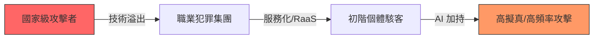

---
layout: default
title: 第 5 章｜地緣政治與新型網路犯罪
---

# 第 5 章：地緣政治與新型網路犯罪

> 2026 年的網路犯罪，已不只是駭客與企業之間的攻防，而是個體、集團與國家級力量交錯的複合戰場。

## 本章摘要

AI 的普及不只降低了攻擊成本，也讓過去只有國家級威脅行為者才具備的能力，逐步落入一般攻擊者手中。網路犯罪因此展現出更強的工業化、軍事化與地緣政治色彩，企業面對的已不再只是單點入侵，而是長鏈條、高擬真與多目標的系統性威脅。

## 5.1 個體攻擊能力的國級化

AI 民主化了先進攻擊技術。原本需要高度專業能力才能完成的漏洞研究、滲透流程、自動化社交工程與惡意軟體調整，如今可由代理型工具大幅簡化。

這讓個體駭客、小型犯罪集團與外包型攻擊服務提供者，都能以更低成本展開多階段攻擊。威脅的差異不再只是誰有技術，而是誰能更快整合資料、算力與現成攻擊鏈。

## 5.2 勒索軟體轉向基礎架構與供應鏈

勒索軟體不再滿足於加密單一終端。到了 2026 年，攻擊者更傾向鎖定虛擬化平台、管理層、ERP 與 OT 依賴的核心資料鏈，因為這些位置更接近企業營運命脈。

一旦虛擬化基礎架構或工控關鍵系統遭到入侵，企業可能在數小時內大範圍癱瘓。這類攻擊的目的不只是索取贖金，更在於以最小入侵面造成最大的營運停擺與談判壓力。

## 5.3 區塊鏈經濟與鏈上犯罪

當更多惡意行為開始利用公共區塊鏈的不可變性與去中心化特性，傳統的清除與阻斷手段也受到挑戰。惡意程式碼、控制訊號或資金流可轉移到鏈上，使追蹤與中止更困難。

此外，DeFi 平台與加密貨幣交易所持續成為高價值目標。對部分國家級威脅行為者而言，鏈上攻擊已不只是犯罪收益來源，也可能是戰略資金管道的一部分。

## 5.4 國家級威脅與企業暴露面的連動

在這種環境下，企業所承受的風險不再只取決於自身防護水準，也取決於所屬產業、供應鏈角色、地理位置與國際法規環境。半導體、製造、能源、物流與跨境供應鏈節點都可能成為優先目標。

因此，企業必須把地緣政治與供應鏈事件納入安全規劃，而不能再把資安視為孤立的 IT 問題。

## 深度分析

這一章真正想指出的，是企業所面對的威脅不再只是「某個駭客正在攻擊我」，而是自己處在什麼產業、連到哪些供應鏈、依賴哪些國際市場與數位基礎設施。當地緣政治升高，軟體、資料、設備與跨境合作關係都可能成為戰略壓力點。企業的暴露面，也因此從資產清單延伸到整個商業生態系。

這種變化使安全策略不能只針對內部網路建模，而必須納入外部依賴。供應商是否可信、外包夥伴是否具備防護能力、物流與製造節點是否可持續運作、公共鏈與金融科技服務是否會成為新攻擊面，這些問題都開始與傳統 IT 安全問題一樣重要。

也就是說，2026 年的威脅情報價值不再只是讓安全團隊知道「誰在打我們」，而是讓企業知道「自己為什麼成為目標」。一旦理解這個層次的原因，防禦才有機會從戰術反應升級成真正的韌性設計。

## 本章結論

2026 年的網路犯罪環境，已演變為國家力量、犯罪經濟與 AI 自動化交互放大的場域。企業若想維持韌性，必須把防禦範圍從內部系統擴展到供應鏈、生態系與外部依賴關係。

## 關鍵字

- 地緣政治
- 國級化攻擊
- 勒索軟體
- 區塊鏈犯罪
- 供應鏈滲透

## 摘要卡

- 核心命題：AI 正讓國家級攻擊能力逐步平民化，企業因此面臨更複合的威脅環境。
- 主要風險：虛擬化平台勒索、鏈上犯罪、供應鏈滲透與產業定向攻擊。
- 防禦重點：把供應鏈、外部依賴與地緣政治納入安全規劃。
- 讀者收穫：理解為何 2026 年的網路犯罪不能只用單一技術事件來看待。

## 引用資料來源

- Verizon. (2025). [2025 Data Breach Investigations Report](https://www.verizon.com/business/resources/reports/dbir/). Verizon Business.
- Federal Bureau of Investigation, Internet Crime Complaint Center. (2025). [2025 IC3 Annual Report](https://www.ic3.gov/AnnualReport/Reports/2025_IC3Report.pdf). U.S. Department of Justice.
- Europol. (2026). [IOCTA 2026: The Evolving Threat Landscape - How Encryption, Proxies and AI Are Expanding Cybercrime](https://www.europol.europa.eu/publication-events/main-reports/iocta-2026-evolving-threat-landscape). European Union Agency for Law Enforcement Cooperation.
- National Institute of Standards and Technology. (2024). [Cybersecurity Framework 2.0](https://doi.org/10.6028/NIST.CSWP.29). U.S. Department of Commerce.

[上一章：第 4 章](./ch04.md)

[下一章：第 6 章](./ch06.md)
