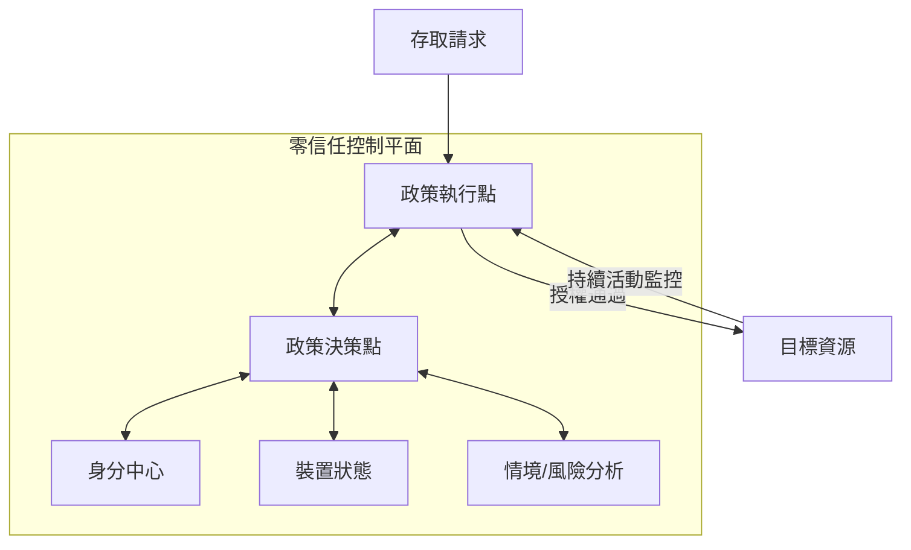

---
layout: default
title: 第 6 章｜零信任 2.0
---

# 第 6 章：零信任 2.0：NSA 實作指引與持續驗證

> 真正的零信任，不是登入前多一道檢查，而是登入後每一次存取、每一段行為都持續受到驗證。

## 本章摘要

當企業面對的是合法帳號遭濫用、應用程式內部權限被挾持，以及 AI 代理與自動化流程交織的環境時，傳統邊界式防護已經不夠。零信任 2.0 的重點，不在名詞更新，而在於把持續驗證、動態授權與可視化決策真正落地到營運中。

## 6.1 從邊界防護轉向持續驗證

零信任的核心邏輯是「永不信任，持續驗證」。它不假設任何網段、設備或帳號天生可信，而是要求每次請求都必須依據身分、裝置狀態、位置、風險情境與行為脈絡重新評估。

這代表防護不再只設在入口，而是延伸到整個連線生命週期。即使使用者已通過登入驗證，只要行為脫離正常模式，系統也應重新要求驗證、限制權限或中止操作。

## 6.2 NSA 實作指引的價值

引用自 NSA 零信任實作指引，重要之處在於它把零信任從抽象原則轉化為可分階段完成的藍圖。企業不需要一次重構所有系統，而是先建立基線，再逐步整合核心元件、策略決策點與跨環境一致的授權邏輯。

這種做法的價值，在於把零信任視為持續營運模式，而不是單一產品採購案。真正成熟的實作，重點是能否持續調整、觀測與驗證，而不是是否購買了某個名詞對應的工具。

## 6.3 驗證後的活動可視性

零信任 2.0 與早期版本的差異，在於更加強調登入後行為。許多重大入侵不是發生在登入前，而是在使用合法憑證進入系統後，透過橫向移動、權限濫用或應用層操作逐步擴張。

因此，企業需要的不只是身分驗證，而是對應用程式內部活動的可視性。誰在什麼時間，從哪個設備，對哪項資料做了哪種操作，都應成為可評估、可追溯與可觸發控制的事件。

## 6.4 動態分割與策略管理

零信任落地後，網路與系統不應再依賴靜態白名單長期放行。透過動態分割與原則驅動的策略管理，組織可以依情境即時調整授權範圍，降低遭入侵後的橫向擴散空間。

這種模式尤其適合混合雲、遠距工作與高自動化環境，因為它將存取控制從固定拓樸轉為可計算的決策流程。

## 深度分析

零信任 2.0 的核心價值，在於它把「可信」從預設狀態變成持續判斷。企業過去很習慣在使用者登入後，給予相對穩定的會話與權限範圍，但在代理大量參與、資料跨平台流動、SaaS 深度整合的環境中，這種做法往往等同於先打開門，再期待沒有意外發生。

更成熟的零信任實作，會要求企業從流程角度重畫授權邊界。也就是說，重點不是只有「誰可以登入」，而是「登入後可以看到什麼、做什麼、做多久、在什麼情境下需要再驗證」。這會讓安全決策從設備與網段層，延伸到應用程式與資料動作層。

從經營角度來看，零信任也不只是風險控制，而是數位營運的基礎建設。當企業能更精確地描述與管理信任，就更有能力安全地支持遠距工作、混合雲、第三方協作與代理式流程。這讓零信任從防禦概念，變成加速現代營運模式的前提。

## 本章結論

零信任 2.0 的真正價值，在於它把防禦重心從「先相信再補救」改成「全程驗證、持續限制」。面對 2026 年的威脅環境，這不只是最佳實務，而是必要條件。

## 關鍵字

- Zero Trust 2.0
- Never Trust Always Verify
- NSA ZIGs
- 動態授權
- 驗證後可視性

## 摘要卡

- 核心命題：零信任 2.0 的重點不是登入前檢查，而是全程驗證與持續授權控制。
- 主要風險：合法帳號被濫用、登入後橫向移動、應用層權限失控。
- 防禦重點：建立身分中心化、策略決策點與登入後行為可視性。
- 讀者收穫：理解零信任如何從概念落到營運模型。

## 引用資料來源

- National Institute of Standards and Technology. (2020). [Zero Trust Architecture (SP 800-207)](https://doi.org/10.6028/NIST.SP.800-207). U.S. Department of Commerce.
- National Institute of Standards and Technology. (2024). [Zero Trust Architecture: A Planning Guide (SP 800-207A)](https://doi.org/10.6028/NIST.SP.800-207A). U.S. Department of Commerce.
- National Security Agency. (2021). [Embracing a Zero Trust Security Model](https://media.defense.gov/2021/Feb/25/2002588479/-1/-1/0/CSI_EMBRACING_ZT_SECURITY_MODEL_UOO11465221.PDF). National Security Agency.
- National Institute of Standards and Technology. (2024). [Cybersecurity Framework 2.0](https://doi.org/10.6028/NIST.CSWP.29). U.S. Department of Commerce.

[上一章：第 5 章](./ch05.md)

## 購買完整電子書

前 6 章試閱到此結束。若想繼續閱讀第 7 章至第 13 章完整內容，請前往 Google Books 購買：

[前往 Google Books 購買完整電子書](https://books.google.com.tw/books/about?id=yj3YEQAAQBAJ&redir_esc=y)
