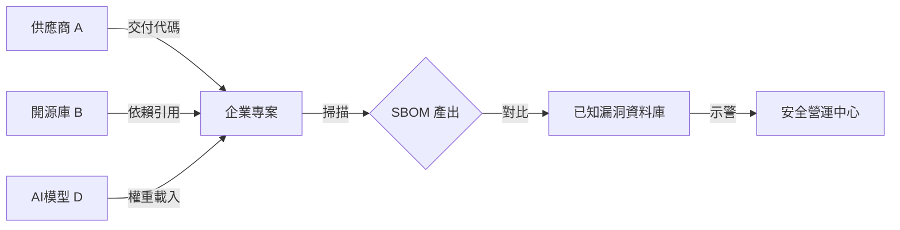

# 第 11 章：供應鏈安全與軟體物料清單（SBOM）

> 在高度互連的軟體世界裡，真正危險的往往不是未知敵人，而是被默認信任的依賴來源。

## 本章摘要

供應鏈風險在 2026 年已成為企業數位韌性的核心課題。當組織大量依賴開源套件、容器映像、第三方服務與 AI 元件時，任何一個被污染的上游來源，都可能成為進入企業內部的捷徑。

## 11.1 對抗供應鏈投毒

攻擊者傾向鎖定被廣泛引用的套件、模型或映像檔，因為這種方式能以單點入侵換取多個下游組織的影響力。對企業來說，風險不只在是否引用惡意程式碼，更在於自己是否知道每個依賴從哪裡來、是否被掃描、是否被簽署。

## 11.2 SBOM 與出處證明

SBOM 的價值，在於讓企業看見軟體的組成與依賴關係。當重大漏洞爆發時，這種透明度可直接決定反應速度。

進一步來看，若能搭配映像簽章、來源驗證與出處證明，企業就不只是知道用了什麼，還能知道它是否來自可信建置流程，以及在交付途中有沒有被竄改。

## 11.3 法規推動與責任上升

供應鏈安全之所以在 2026 年變得更迫切，不只是因為威脅變多，也因為法規開始要求企業對數位產品生命週期負起更多責任。CRA 等法規趨勢，正把供應鏈治理從選配提升為董事會層級議題。

## 11.4 重新定義供應商信任

企業不能再用價格與交期作為唯一採購標準。供應商是否具備安全能力、是否能提供證明、是否有中斷應變與通報機制，都應成為選商條件的一部分。

## 延伸書稿段落

供應鏈安全最大的誤區，是把它當作採購或法遵問題，而不是產品信任問題。實際上，當軟體由大量第三方元件、建置流程與外部服務共同組成時，企業能否證明這些東西來自哪裡、經過什麼流程、是否被改動，將直接決定它能否說服客戶與監管者相信自己的產品是可信的。

這也是 SBOM、來源驗證與出處證明越來越重要的原因。它們並不是額外增加的文件負擔，而是企業在複雜供應鏈環境中重新建立可信敘事的方式。當出現重大漏洞或供應鏈事件時，沒有這些資料的企業將很難快速回答最基本的問題：我們用了什麼、從哪裡來、影響到哪裡。

未來的採購與合作關係也會因此改變。供應商不再只需要交付功能，還需要交付證據。能夠提供可驗證供應鏈資訊的廠商，將在法規與市場信任雙重壓力下擁有更高競爭力。

## 本章結論

供應鏈安全的本質，是重新界定什麼叫做可信。當軟體組成愈來愈複雜，企業就愈需要用 SBOM、簽章與供應商治理，補上信任機制的缺口。

## 關鍵字

- SBOM
- Provenance
- Container Signing
- CRA
- 供應商治理

## 摘要卡

- 核心命題：在高度依賴外部元件的時代，供應鏈透明度就是信任基礎。
- 主要風險：開源套件投毒、映像被竄改、供應商成為下游滲透入口。
- 防禦重點：建立 SBOM、來源驗證、映像簽章與採購安全標準。
- 讀者收穫：理解供應鏈安全為何已成為董事會層級議題。

## 引用資料來源

- European Union. (2024). [Regulation (EU) 2024/2847: Cyber Resilience Act](https://eur-lex.europa.eu/legal-content/EN/TXT/?uri=CELEX%3A32024R2847). Official Journal of the European Union.
- European Commission. (2025). [Cyber Resilience Act](https://digital-strategy.ec.europa.eu/en/policies/cyber-resilience-act). Directorate-General for Communications Networks, Content and Technology.
- SLSA. (n.d.). [Supply-chain Levels for Software Artifacts](https://slsa.dev/). OpenSSF.
- Sigstore Project. (n.d.). [Sigstore](https://www.sigstore.dev/). OpenSSF.

[上一章：第 10 章](./ch10.md)

[下一章：第 12 章](./ch12.md)