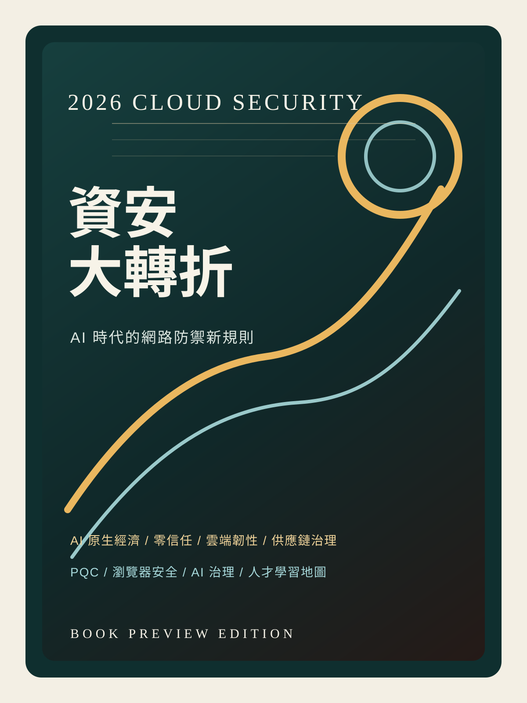

<section class="hero">

2026 Book Preview
<h1>《2026 資安大轉折》</h1>

當企業從 AI 輔助走向 AI 原生，安全不再只是防守成本，而是決定組織能否加速創新、維持信任與穿越風險的營運核心。

這是一部寫給雲端架構師、資安團隊與技術決策者的趨勢書稿，從 AI 原生經濟、代理型攻擊、零信任 2.0、雲端原生防護、供應鏈安全、量子遷移到 AI 治理，系統化整理 2026 年最關鍵的攻防變局。

<a class="button-primary" href="./chapters/ch01.html">立即試閱</a>
<a class="button-secondary" href="./references.html">參考文獻</a>

<strong>13 章</strong>深入剖析 2026 資安版圖

<strong>5 大篇章</strong>從 AI 威脅、架構治理到人才培育完整銜接

<strong>2026</strong>聚焦 AI 原生時代的規則重寫

</section>

<section class="quote-strip">
<article class="quote-box">
<h2>推薦語 01</h2>

不是又一本談 AI 的技術清單，而是一本把 2026 年攻防規則講清楚的資安趨勢書。

</article>
<article class="quote-box">
<h2>推薦語 02</h2>

適合需要在董事會、SOC、雲端團隊與治理單位之間翻譯風險的人。

</article>
<article class="quote-box">
<h2>推薦語 03</h2>

如果你只想先讀一本理解 AI 原生時代防禦邏輯的中文書，這本書就是入口。

</article>
</section>

<section class="section-card">
<h2>內容簡介</h2>

《2026 資安大轉折》聚焦一個核心問題：當 AI 同時放大攻擊面與防禦能力，企業該如何重新定義資安？本書將 2026 年視為從「AI 輔助」轉向「AI 原生」的關鍵轉折點，分析代理型詐騙、提示詞注入、資料中毒、供應鏈投毒與治理責任升高等變化，並提出以零信任、雲端原生安全、自動化營運與持續驗證重建數位韌性的實務方向。

</section>

<section class="feature-grid">
<article>
<h2>技術層</h2>

從 AI 代理、提示詞注入、資料中毒、零信任、CTEM、PQC 到 SBOM，建立完整的攻防地圖。

</article>
<article>
<h2>管理層</h2>

討論安全如何從成本中心轉化為創新引擎，以及董事會責任與法規壓力如何改變決策。

</article>
<article>
<h2>人才層</h2>

重新定義 AI 原生時代的團隊能力、治理角色與專業認證學習路徑。

</article>
</section>

<section class="section-card">
<h2>這本書的特色</h2>

這不是一本只討論單一技術的工具書，而是一部把 2026 年資安環境重新整合成可閱讀全景的趨勢作品。它把 AI、雲端、供應鏈、治理與人才問題放進同一條敘事軸線，讓讀者不只知道哪些威脅正在升高，更能理解整個規則為何改變，以及企業接下來該怎麼做。

</section>

<section class="reader-grid">
<article>
<h2>關於本書</h2>

本書由資深雲端資安專家與 AI 研究團隊共同編寫。定位聚焦於雲端安全、AI 治理、供應鏈風險與企業防護架構，為決策者與技術專家提供具備前瞻性的行動指南。

</article>
<article>
<h2>目標讀者</h2>

適合雲端與資安架構師、SOC 與 IR 團隊、CISO 與技術主管，以及正在學習零信任、雲端安全與 AI 風險治理的專家與讀者。

</article>
<article>
<h2>版權與試閱聲明</h2>

本網站內容為書稿預覽版本，旨在分享 2026 年資安關鍵趨勢與核心架構。內容受著作權保護，未經書面許可請勿將完整章節用於商業用途。

</article>
</section>

<section class="section-card">
<h2>試閱章節</h2>
<ol class="chapter-list">
<li><a href="./chapters/ch01.html">第 1 章：2026，AI 經濟的新規則</a></li>
<li><a href="./chapters/ch02.html">第 2 章：防衛者之年：重奪主動權</a></li>
<li><a href="./chapters/ch03.html">第 3 章：自動化詐騙的崛起</a></li>
<li><a href="./chapters/ch04.html">第 4 章：操控 AI 的攻擊</a></li>
<li><a href="./chapters/ch05.html">第 5 章：地緣政治與新型網路犯罪</a></li>
<li><a href="./chapters/ch06.html">第 6 章：零信任 2.0</a></li>
</ol>
</section>

<section class="faq-grid">

這本書比較偏技術，還是偏管理？

兩者都有，但不是平均分配。本書以技術趨勢為基底，進一步延伸到治理、法規、組織與人才，因此特別適合需要把技術議題轉譯成決策語言的讀者。

如果我不是資安背景，讀得懂嗎？

可以。章節設計避免只對單一工具或單一廠牌做深度依賴，而是把攻擊路徑、風險變化與防禦思路講清楚，對具備 IT、雲端或管理背景的讀者相對友善。

為什麼這本書適合 2026 年出版？

因為 2026 年正處於多條曲線交會的時點：AI 原生營運擴張、供應鏈風險升高、零信任落地成熟、PQC 遷移進入規劃期，治理責任也從技術問題升高成經營問題。

</section>

<section class="buyer-grid">
<article>
<h2>閱讀入口</h2>

<a href="./book.html">閱讀全書總覽</a>

<a href="./chapters/ch01.html">從第 1 章開始閱讀</a>

<a href="./references.html">查看正式參考文獻</a>

</article>
</section>

